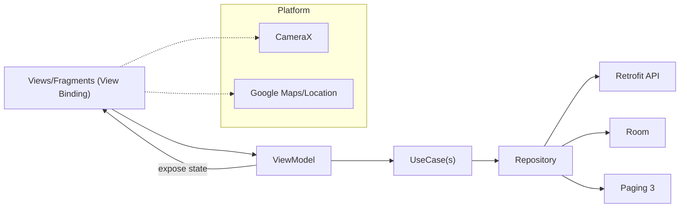
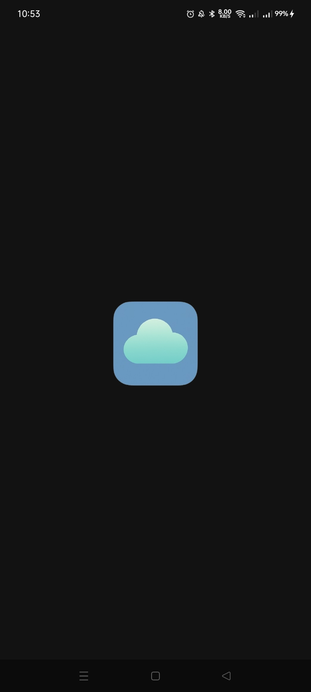
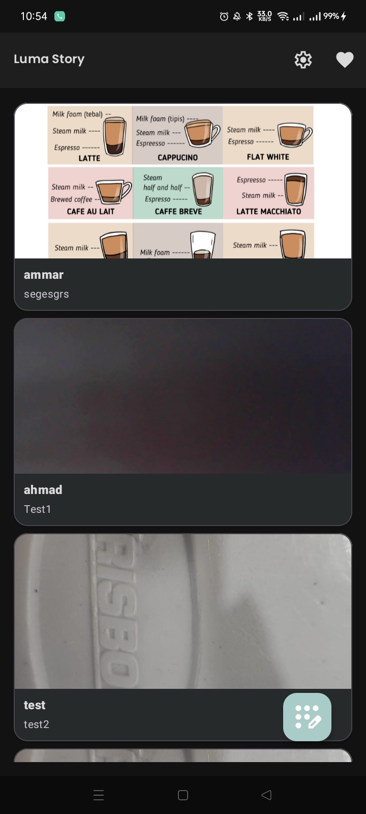
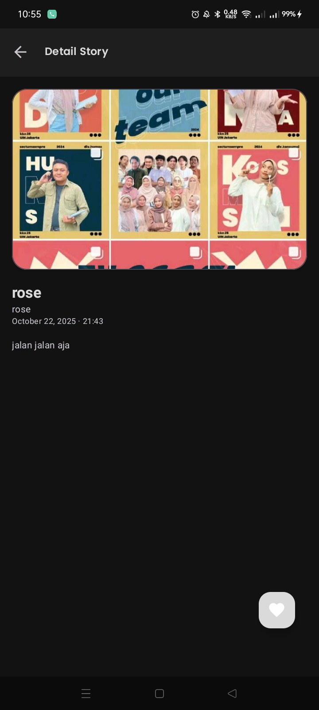

# Luma

<div align="center">
  
</div>

A modern Android app built with Kotlin, showcasing clean architecture with MVVM, Koin DI, Room,
Retrofit, and Paging. It uses View Binding for UI, CameraX for camera features, and Google
Maps/Location for geospatial features.

---

## Tech Stack

- **Language**: Kotlin
- **Android**: minSdk 27, targetSdk 36, AGP 8.13.0
- **UI**: View Binding, Material Components, ConstraintLayout, Lottie
- **Navigation**: AndroidX Navigation (Safe Args)
- **DI**: Koin
- **Data**:
    - Retrofit + Gson Converter
    - OkHttp Logging Interceptor
    - Room (runtime, ktx, paging)
    - Paging 3
- **Concurrency**: Kotlin Coroutines
- **Media**: CameraX (camera2, lifecycle, view), Coil image loader
- **Location/Maps**: Google Play Services Location + Maps
- **Debug/Logs**: Chucker (debug only), Timber
- **Testing**: JUnit 5, MockK, Coroutines Test, AndroidX Core Testing, Koin Test

Key gradle references:

- `app/build.gradle.kts` for module config and dependencies
- `gradle/libs.versions.toml` for versions catalog

---

## Architecture

- **Presentation**: MVVM using ViewModel + Coroutines (and likely Flow) with View Binding
- **Domain**: Use cases (optional) and interfaces for repositories
- **Data**: Repository pattern over local (Room) and remote (Retrofit) data sources, with
  PagingSource/Pager for paginated flows
- **DI**: Koin modules wiring data, domain, and presentation layers



---

## Design Patterns & Practices

- **MVVM** for separation of concerns
- **Repository** to abstract data sources
- **Dependency Injection** via Koin
- **Observer/Reactive** with Coroutines (Flows/Channels)
- **Paging** with `PagingSource` + `Pager`
- **Navigation** with Safe Args for type-safe argument passing
- **Logging** via Timber; **Network inspection** via Chucker (debug)

---

## 📷 Screenshots

| Splash Screen                                  | Home                                         | Event Details                                  |
|------------------------------------------------|----------------------------------------------|------------------------------------------------|
|  |  |  |

---

## Getting Started

### Prerequisites

- Android Studio (latest stable)
- JDK 17
- Android SDK Platform 36, Build Tools matching AGP 8.13.0

### Installation

1. Clone the repository:
   ```bash
   git clone https://github.com/halimjr11/Luma.git
   ```
2. Open the project in Android Studio.
3. Create a `local.properties` file in the root directory if it doesn't exist.
4. Add your API base URL to `local.properties` (if your backend requires it):
   ```properties
   BASE_URL=your_api_base_url_here
   ```
5. Add your Google Maps API key:
   - Open or create `app/src/main/res/values/secrets.xml`.
   - Set the `google_maps_key` value to your key:
     ```xml
     <?xml version="1.0" encoding="utf-8"?>
     <resources>
         <string name="google_maps_key" templateMergeStrategy="preserve" translatable="false">YOUR_GOOGLE_MAPS_API_KEY</string>
     </resources>
     ```
   - Keep real keys out of public commits. Prefer using private branches or environment-based secrets for distribution.
6. Sync the project with Gradle files.
7. Build and run the app on an emulator or physical device.

### 🧪 Testing

Run unit tests:

```bash
./gradlew test
```

---

## Project Structure (high-level)

```
app/
  src/
    main/
      java/com/halimjr11/luma/...
      res/...
    test/...
    androidTest/...
  build.gradle.kts
build.gradle.kts
gradle/libs.versions.toml
```

---

## License

MIT License

Copyright (c) 2025 Nurhaq Halim

Permission is hereby granted, free of charge, to any person obtaining a copy
of this software and associated documentation files (the "Software"), to deal
in the Software without restriction, including without limitation the rights
to use, copy, modify, merge, publish, distribute, sublicense, and/or sell
copies of the Software, and to permit persons to whom the Software is
furnished to do so, subject to the following conditions:

The above copyright notice and this permission notice shall be included in all
copies or substantial portions of the Software.

THE SOFTWARE IS PROVIDED "AS IS", WITHOUT WARRANTY OF ANY KIND, EXPRESS OR
IMPLIED, INCLUDING BUT NOT LIMITED TO THE WARRANTIES OF MERCHANTABILITY,
FITNESS FOR A PARTICULAR PURPOSE AND NONINFRINGEMENT. IN NO EVENT SHALL THE
AUTHORS OR COPYRIGHT HOLDERS BE LIABLE FOR ANY CLAIM, DAMAGES OR OTHER
LIABILITY, WHETHER IN AN ACTION OF CONTRACT, TORT OR OTHERWISE, ARISING FROM,
OUT OF OR IN CONNECTION WITH THE SOFTWARE OR THE USE OR OTHER DEALINGS IN THE
SOFTWARE.

---

## Acknowledgements
- [Android Developers](https://developer.android.com/) for their excellent documentation
- [Kotlin](https://kotlinlang.org/) for making Android development enjoyable
- [JetBrains](https://www.jetbrains.com/) for their amazing IDEs
- [Dicoding](https://www.dicoding.com/) for their course and education
- All open-source libraries used in this project
